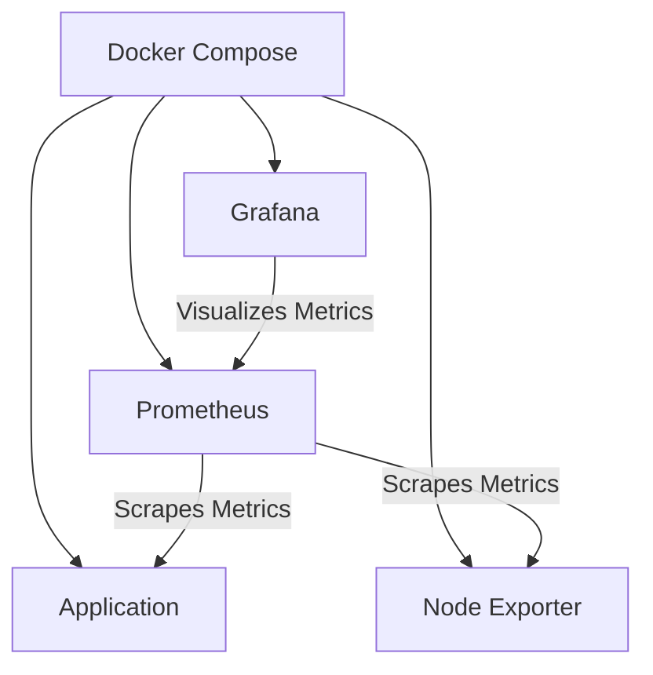
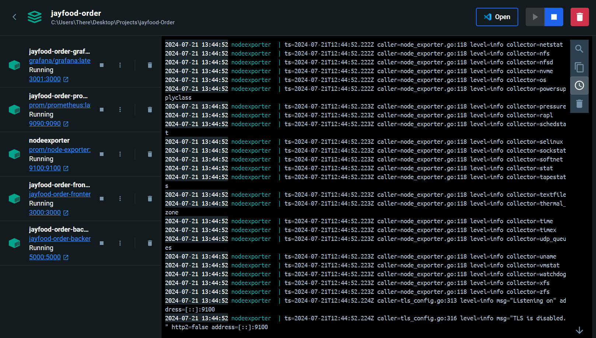
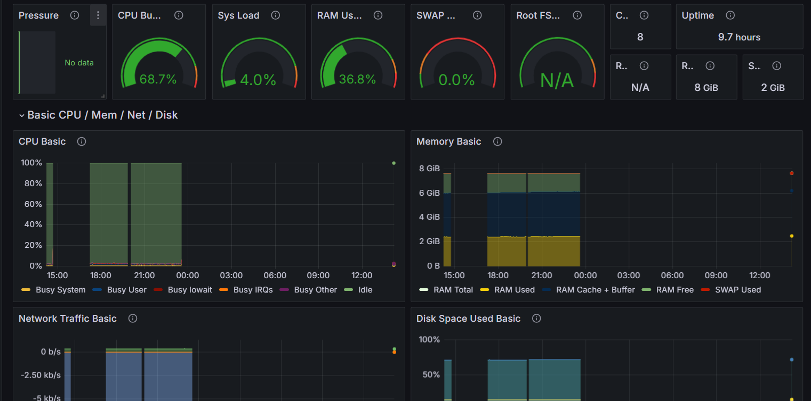
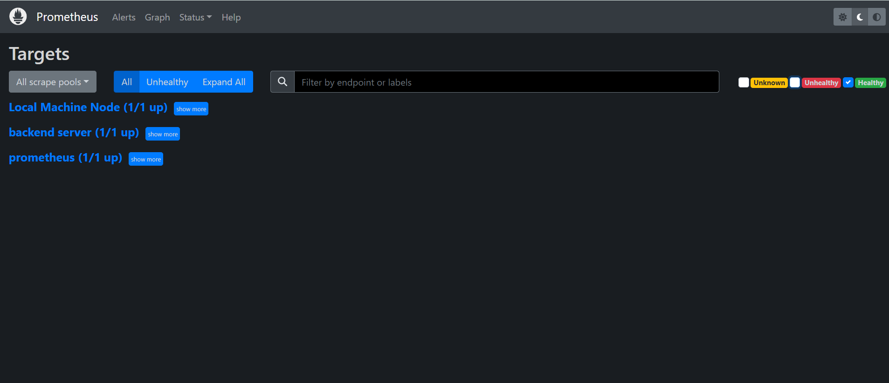

# Project Title: Fast Food app Monitoring & Alerting Project

## Overview
This project demonstrates the setup of a monitoring system using Docker Compose, Prometheus, Node Exporter, and Grafana. The application was originally developed by Jaji Moshood. I extended their work by dockerizing the application and adding monitoring capabilities.

## Table of Contents
- [Overview](#overview)
- [Features/Addition](#features)
- [Installation](#installation)
- [Usage](#usage)
- [Screenshots](#screenshots)
- [Flowchart](#flowchart)
- [Credits](#credits)
- [License](#license)

## Features/Addition
- **Dockerized Application**: I containerized the entire application for easy deployment and management.
- **Metrics Collection**: I added a `metrics.js` file to scrape backend metrics.
- **Monitoring Orchestration**: Docker Compose is used to build and run the application, Prometheus, Node Exporter, and Grafana.
- **Visualization**: Grafana is set up for monitoring visualization, with all targets properly configured.

## Installation
To set up the project, follow these steps:

1. Clone the repository:
   ```sh
   git clone https://github.com/Gbolahan-Aziz/Fast-Food-app-Monitoring-Alerting.git
   cd Fast-Food-app-Monitoring-Alerting

2. Update the prometheus.yaml file by adding your ip-address where indicated.

3. Build and start the services using Docker Compose:
    ```sh
    docker-compose up -d

4. Access the services:
    - Frontend: http://localhost:3000
    - Backend: http://localhost:5000
    - Prometheus: http://localhost:9090
    - Grafana: http://localhost:3001
    - Node-Exporter: http://localhost:9100

## Usage
Once the services are up and running, you can navigate to Grafana and Prometheus to view the collected metrics and visualize them.

## Flowchart


## Screenshots
Here are some screenshots showcasing the running containers, Grafana dashboard, and Prometheus server with all targets up:




## Credits
- Application Developer: [Jaji Moshood](https://github.com/jaymhorsh)

- Monitoring Setup and Dockerization: [Azeez Razaq](https://github.com/Gbolahan-Aziz)


## Licence
This project is licensed under the MIT License. See the LICENSE file for details.